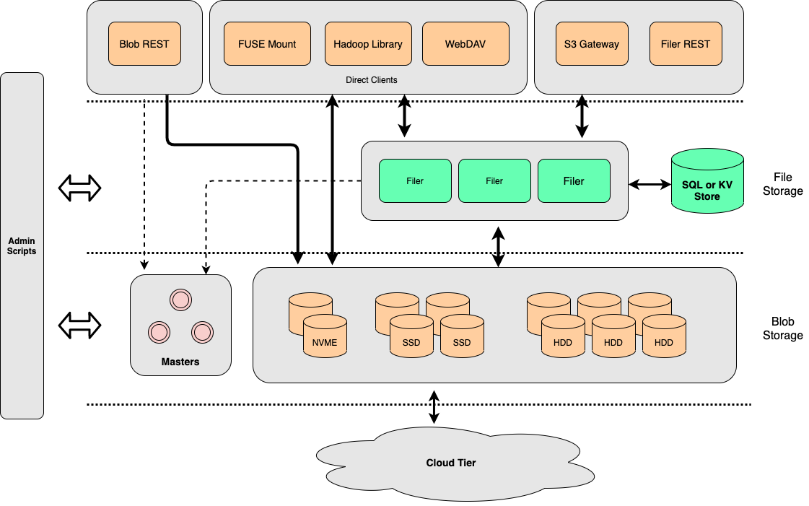
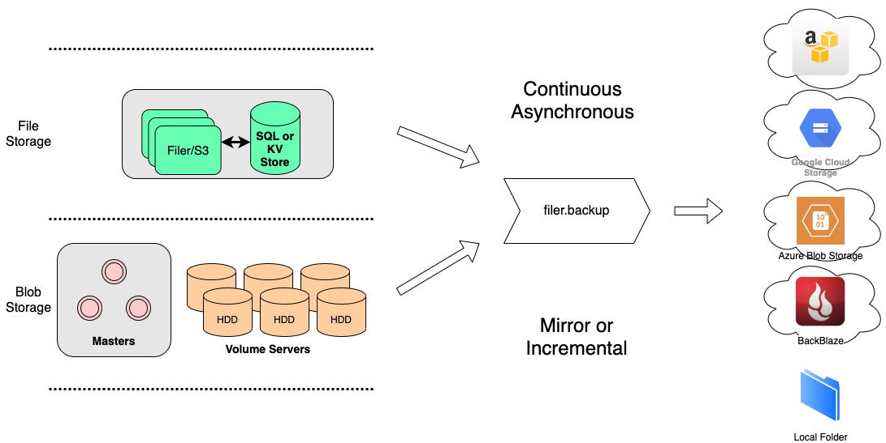
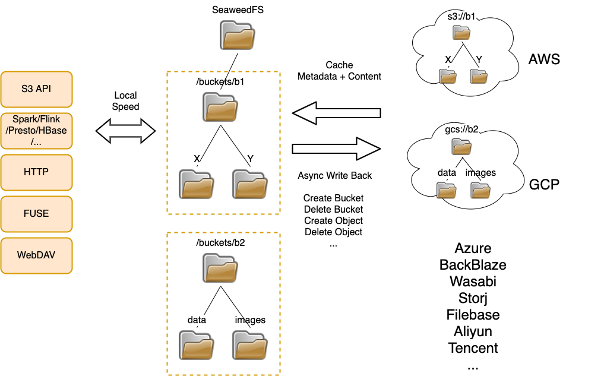
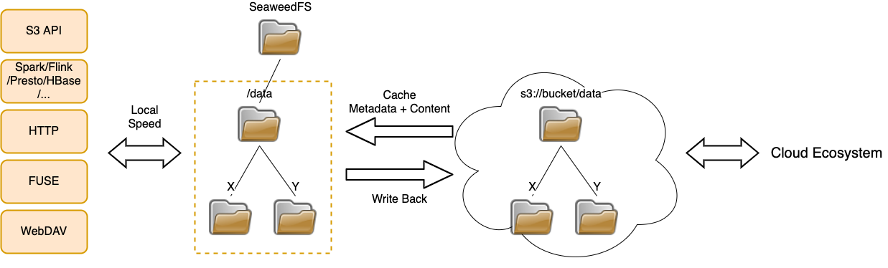
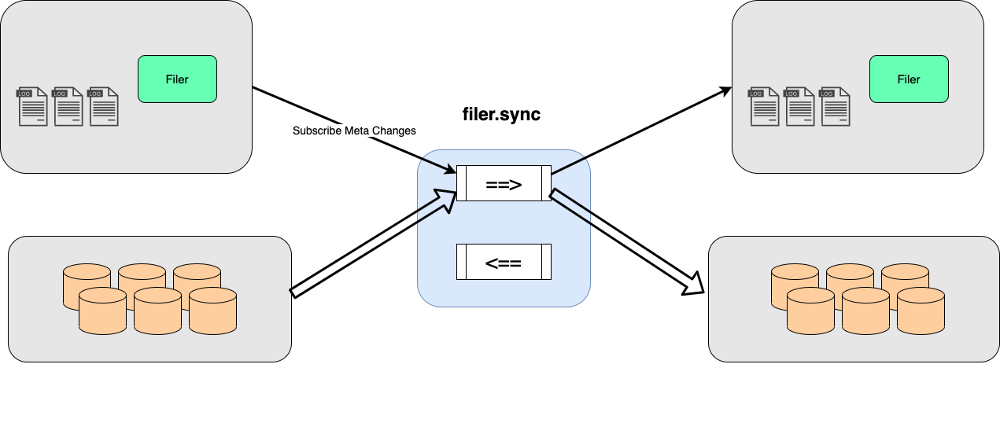

# Bookworm

OSS (Object Storage Service) for serving the books and covers. We mainly reuse the code from
[SeaweedFS](https://github.com/seaweedfs/seaweedfs). Since it's a big project, and we don't want all the functions it
has been provided. We have to self maintain this project to provide the functions that
[BookStairs](https://github.com/bookstairs/bookstairs) may need. This project will be bundled into the final bookstairs
distributions.

Since we don't promise the backward compatible, we sincerely are you that **DO NOT USE THIS PROJECT IN YOUR CODE.**
Use the original SeaweedFS instead.

## Architecture Diagram

## Thanks

Thanks to [Chris Lu](https://github.com/chrislusf) and other SeaweedFS developers.

## License

This project is licensed under the AGPL-3.0 license.
